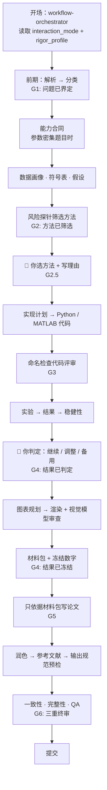

<div align="center">


**31 个 skill · 6 道 gate · 3 重终审 —— 给数学建模竞赛装上的护栏系统。**

<a href="./README.md">English</a> · <a href="./README-zh.md"><b>简体中文</b></a>

[](LICENSE)
[](#31-个-skill-一览)
[](CLAUDE.md)
[](AGENTS.md)
[](docs/competition-output-spec-zh.md)

</div>

---

## 这是什么

EasyMathModel 是 **31 个 agent 技能** 的集合，给数学建模竞赛套上一套可检查的护栏。它不是又一个模型库，也不是一键写论文的工具，而是一条工作流：解析、分类、筛选、实现、验证、冻结、写作、审计——每一步都必须有证据落盘，才允许进入下一步。

分工很简单：

- AI 负责账目：解析题目、数据画像、风险探针、代码、数字冻结、图表校验、一致性审计。
- **你负责拍板**：选哪个方法、数字意味着什么、假设怎么表述、结论能说多远。

每一个属于人的决定都会写进只增不改的决策账本（`qx_decisions.jsonl`）。任何一道 gate 都不会在空盒子、占位符或 AI 自问自答的建议上放行。

## 它帮你避开什么

**理解错了题意。** 你花一下午建好了题目「显然」想要的模型，才发现某个句子是另一个意思。这里在讨论任何方法之前，先强制完成题目解析和人的框架确认。

**论文里的数字找不到出处。** 论文写 92.4%，但仓库里没有任何脚本输出 92.4%。在这里，每个关键数字都必须能追溯到 `frozen_numbers.json`——它由真实运行产生，禁止手改。

**基线凭空消失。** 「明显比基线好」——但基线根本没跑过。在这里，基线要用和主方法同样的风险探针筛选，并通过同名检查的代码评审。

**改完 bug 忘了同步论文。** 凌晨三点修好了 bug，论文还引着旧值。改动冻结数字必须记录解冻、重跑受影响部分、重新冻结。

**题面要求悄悄缩水。** 题目要事件抽取，代码做的是关键词匹配，没人发现。`planning/capability_checklist.json` 把每个必需能力变成可证伪的验收项，代码必须证明自己真的做到了。

## 六道护栏

1. **G1 — 问题已界定。** 解析、分类、数据清单、成功标准、人的框架确认，缺一不可。
2. **G2 — 方法已筛选。** 一个主方法、一个可信基线、最多一个条件性备用，各自通过风险探针（数据覆盖、假设、输出退化、扰动、规模）。
3. **G2.5 — 人来拍板。** 你选定方法并写下理由，AI 原样记录，不替你发明理由。
4. **G3 — 代码已审查。** 五项命名检查（语法、输入契约、方法对齐、可复现性、输出契约），逐项留 JSON 证据。
5. **G4 — 数字已冻结。** `frozen_numbers.json` 是论文数字的唯一来源；改动必须记录解冻并重新冻结。
6. **G6 — 三重终审。** 一致性、完整性、QA 三个独立审计全部通过才允许定稿；任何一个失败都卡住提交。

## 一场比赛怎么走完



两条承重边界最关键：**G2** 在完整实现前拦住假设和可行性问题；**G4** 杜绝旧数字进入论文。

## 31 个 skill 一览

| 阶段 | 技能 | 作用 |
|---|---|---|
| **前期** | `workflow-orchestrator` · `problem-parser` · `problem-classifier` · `capability-contract-builder` · `related-paper-analyzer` · `symbol-table-builder` · `model-assumptions-builder` · `data-auditor-cleaner` | 老实界定问题、盘点数据，把每个要求钉成可验收的能力项 |
| **方法** | `method-selector` · `decision-prompt-builder` · `modeler-decision-logger` | 筛选短名单、把真实取舍摆到你面前、记录你的决定 |
| **实现** | `model-code-analyzer` · `python-model-code-generator` · `matlab-model-code-generator` · `code-reviewer` · `python-code-reviewer` · `matlab-code-reviewer` | 把获批方法变成最小、可评审、可复现的代码 |
| **证据** | `result-report-generator` · `robustness-checker` · `final-method-explainer` · `figure-table-planner` · `math-figure-generator` · `figure-vision-review` · `solution-package-builder` | 构建紧凑证据、测试最可能翻车的地方、用视觉模型审查论文图、冻结获批数字 |
| **写作与终审** | `paper-section-writer` · `paper-polisher` · `reference-manager` · `output-standards-auditor` · `consistency-auditor` · `completeness-auditor` · `quality-assurance-auditor` | 只依据材料包写作、诚实润色、通过三个独立终审 |

`.claude/skills/` 与 `.codex/skills/` 都是完整可独立使用的副本——装一套或两套都行。

## 开始使用

### 方案 A — 放进比赛项目（推荐）

```bash
git clone https://github.com/goblinIBigBro/EasyMathModel.git .skills-tmp
mv .skills-tmp/.claude .claude
mv .skills-tmp/.codex .codex
mv .skills-tmp/CLAUDE.md .
mv .skills-tmp/AGENTS.md .
mv .skills-tmp/docs ./docs
rm -rf .skills-tmp
```

### 方案 B — 全局安装到 Claude Code

```bash
git clone https://github.com/goblinIBigBro/EasyMathModel.git
cd EasyMathModel
mkdir -p ~/.claude/skills
for d in .claude/skills/*/; do cp -R "$d" ~/.claude/skills/; done
```

### 方案 C — 全局安装到 Codex

```bash
git clone https://github.com/goblinIBigBro/EasyMathModel.git
cd EasyMathModel
mkdir -p ~/.codex/skills
for d in .codex/skills/*/; do cp -R "$d" ~/.codex/skills/; done
```

以后更新：`git pull`，然后重跑对应方案的复制循环。

## 第一次会话

```text
先读 CLAUDE.md（或 AGENTS.md），然后调用 workflow-orchestrator。
题目在 workspace/problem/，按 gate 顺序走，不要跳步。
```

常用跟进：

- `Q2 round1 已出结果。让 workflow-orchestrator 判断是继续迭代还是锁方法。`
- `让 robustness-checker 跑 Q1，输入在 results/Q1/reports/，基线在 results/Q1/experiments/round2/。不要重跑主模型。`
- `所有 Qx 章节起草完毕。依次跑 consistency-auditor、completeness-auditor、quality-assurance-auditor。`

## 目录结构

<details>
<summary>Workspace 地图</summary>

```text
project/
├── planning/
│   ├── parse/  classification/  manifests/Qx.json
│   ├── capability_checklist.json
│   ├── symbol_table.md  model_assumptions.md
│   ├── session_config.json  vision_config.json
├── methods/Qx/
│   ├── qx_method_card.md  qx_decisions.jsonl
│   └── probes/risk_probe_summary.json
├── code/
│   ├── Qx/                        # Python
│   └── matlab/Qx/                 # MATLAB / 北太天元
├── results/Qx/
│   ├── experiments/roundN/        # figures / tables / metrics / run_summary.json
│   └── reports/                   # 分析 + 材料包 + frozen_numbers.json
├── robustness/Qx/
├── paper/
│   ├── sections/  figures/  audits/
│   ├── refs.bib  main.tex  qa_report.md
├── workspace/
│   ├── data_raw/                  # 只读
│   ├── data_clean/
│   └── archived/
└── scratch/
```

</details>

## 文档

| 资源 | 用途 |
|---|---|
| [输出规范](docs/competition-output-spec-zh.md) | 完整打包的契约：能力验收、图表清单、摘要、页数、溯源、合规 |
| [Output specification](docs/competition-output-spec.md) | English version |
| [CLAUDE.md](CLAUDE.md) / [AGENTS.md](AGENTS.md) | Claude Code / Codex 的运行规则 |
| [Implementation targets](docs/implementation-targets.md) | Python 还是 MATLAB |
| [MATLAB 指南](docs/matlab-beita-tianyuan-guidelines.md) | 北太天元兼容编码 |
| [Initial Prompt](Initial%20Prompt-zh.md) | 新会话的开场提示 |

## 边界

- 在脚本产出数字之前，不会往论文里写任何数字。
- 不编造数据、结果、引用或图注。
- 不替你选方法、不替你解释结果、不替你写贡献表述。
- 各赛事的 AI 使用政策逐年不同，请自行核对当年官方规则；最终合规判断永远是你的责任。

## 致谢与许可

- 本仓库延续自 Zhijun Zhang 的 [MathModeling-skills](https://github.com/zhnnky329/MathModeling-skills)（MIT），原版权声明保留在 [LICENSE](LICENSE) 中。
- `math-figure-generator` 借鉴了 [nature-skills](https://github.com/Yuan1z0825/nature-skills)（Yuan1z0825，MIT）与 [figures4papers](https://github.com/ChenLiu-1996/figures4papers) 的生产级绘图脚本。
- EasyMathModel 以 MIT 协议发布。 © 2026 chentong

有问题或反馈？欢迎提 issue，或联系 **3480567299@qq.com**。
