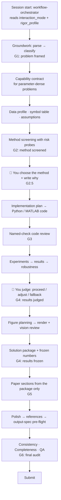

<div align="center">


**31 skills · 6 gates · 3 final audits — a guardrail kit for mathematical modeling contests.**

<a href="./README.md"><b>English</b></a> · <a href="./README-zh.md">简体中文</a>

[](LICENSE)
[](#the-31-skills-at-a-glance)
[](CLAUDE.md)
[](AGENTS.md)
[](docs/competition-output-spec.md)

</div>

---

## What is this?

EasyMathModel is a collection of **31 agent skills** that wrap a math-modeling contest in checkable guardrails. It is not another model zoo and not a paper factory. It is a workflow: every step—parse, classify, screen, implement, verify, freeze, write, audit—can only move forward when its evidence exists on disk.

The division of labor is simple:

- The AI does the bookkeeping: parsing, data profiling, risk probes, code, frozen numbers, figure checks, and audits.
- **You make the calls**: which method, what the numbers mean, what the assumptions say, and how far the claims reach.

Every human-owned decision is recorded in an append-only ledger (`qx_decisions.jsonl`). A gate never passes on an empty box, a placeholder, or a suggestion the AI wrote for itself.

## What pain does it remove?

**The wrong interpretation.** You spend an afternoon building the model the problem "obviously" wants, then realize a single sentence meant something else. The workflow forces an explicit problem parse and a human framing check before any method is discussed.

**Numbers nobody can reproduce.** The paper says 92.4%, but no script in the repo outputs 92.4%. Here, every claim-relevant number must trace to `frozen_numbers.json`, which is produced from real runs and never edited by hand.

**Baselines that vanish.** A method is "clearly better than the baseline"—except the baseline was never run. Here, a usable baseline is screened with the same risk probe as the main method, and both are reviewed by named checks.

**Late fixes that don't propagate.** The bug is fixed at 3 a.m., but the paper still quotes the old value. Changing a frozen number requires logging the thaw, rerunning the affected work, and re-freezing.

**Requirements that silently shrink.** The problem asks for event extraction; the code does keyword counting; nobody notices. `planning/capability_checklist.json` turns every required capability into a falsifiable acceptance item that code must prove.

## Guardrails at a glance

1. **G1 — Problem framed.** Parse, classification, data inventory, success criteria, and human framing must exist before anything else.
2. **G2 — Method screened.** One main candidate, one usable baseline, at most one conditional fallback—each passing a method-specific risk probe (data coverage, assumptions, output degeneracy, perturbation, scale).
3. **G2.5 — Human choice.** You commit the method and write the rationale; the AI records it verbatim.
4. **G3 — Code reviewed.** Five named checks (syntax, input contract, method alignment, reproducibility, output contract) with JSON evidence.
5. **G4 — Numbers frozen.** `frozen_numbers.json` is the only source for paper numbers; changes require a logged thaw and re-freeze.
6. **G6 — Three auditors.** Consistency, completeness, and QA must all pass. One failure blocks submission.

## How a contest run unfolds



Two boundaries carry the most weight: **G2** catches assumption and feasibility failures before full implementation, and **G4** stops stale numbers from ever reaching the paper.

## The 31 skills at a glance

| Phase | Skills | What they do for you |
|---|---|---|
| **Preparation** | `workflow-orchestrator` · `problem-parser` · `problem-classifier` · `capability-contract-builder` · `related-paper-analyzer` · `symbol-table-builder` · `model-assumptions-builder` · `data-auditor-cleaner` | Frame the problem honestly, inventory the data, and pin every requirement to a checkable capability |
| **Method** | `method-selector` · `decision-prompt-builder` · `modeler-decision-logger` | Screen a shortlist, put real trade-offs in front of you, and record your choice |
| **Implementation** | `model-code-analyzer` · `python-model-code-generator` · `matlab-model-code-generator` · `code-reviewer` · `python-code-reviewer` · `matlab-code-reviewer` | Turn the approved method into minimal, reviewable, reproducible code |
| **Evidence** | `result-report-generator` · `robustness-checker` · `final-method-explainer` · `figure-table-planner` · `math-figure-generator` · `figure-vision-review` · `solution-package-builder` | Build compact evidence, test what is most likely to break, vision-review paper figures, and freeze approved numbers |
| **Writing & audit** | `paper-section-writer` · `paper-polisher` · `reference-manager` · `output-standards-auditor` · `consistency-auditor` · `completeness-auditor` · `quality-assurance-auditor` | Draft from the package, polish honestly, and pass three independent final audits |

Both `.claude/skills/` and `.codex/skills/` are complete standalone copies—install either one, or both.

## Getting started

### Option A — inside a contest project (recommended)

```bash
git clone https://github.com/Gob1inBr0/EasyMathModel.git .skills-tmp
mv .skills-tmp/.claude .claude
mv .skills-tmp/.codex .codex
mv .skills-tmp/CLAUDE.md .
mv .skills-tmp/AGENTS.md .
mv .skills-tmp/docs ./docs
rm -rf .skills-tmp
```

### Option B — global for Claude Code

```bash
git clone https://github.com/Gob1inBr0/EasyMathModel.git
cd EasyMathModel
mkdir -p ~/.claude/skills
for d in .claude/skills/*/; do cp -R "$d" ~/.claude/skills/; done
```

### Option C — global for Codex

```bash
git clone https://github.com/Gob1inBr0/EasyMathModel.git
cd EasyMathModel
mkdir -p ~/.codex/skills
for d in .codex/skills/*/; do cp -R "$d" ~/.codex/skills/; done
```

To update later: `git pull`, then re-run the copy loop for whichever option you used.

## First session

```text
Read CLAUDE.md (or AGENTS.md), then run workflow-orchestrator.
Our contest problem is in workspace/problem/. Follow the gates in order.
```

Handy follow-ups:

- `Q2 round1 is done. Let workflow-orchestrator decide whether to iterate or lock the method.`
- `Run robustness-checker for Q1. Inputs in results/Q1/reports/, baseline in results/Q1/experiments/round2/. Do not rerun the main model.`
- `All Qx sections are drafted. Run consistency-auditor, then completeness-auditor, then quality-assurance-auditor.`

## Where things live

<details>
<summary>Workspace map</summary>

```text
project/
├── planning/
│   ├── parse/  classification/  manifests/Qx.json
│   ├── capability_checklist.json
│   ├── symbol_table.md  model_assumptions.md
│   ├── session_config.json  vision_config.json
├── methods/Qx/
│   ├── qx_method_card.md  qx_decisions.jsonl
│   └── probes/risk_probe_summary.json
├── code/
│   ├── Qx/                        # Python
│   └── matlab/Qx/                 # MATLAB / 北太天元
├── results/Qx/
│   ├── experiments/roundN/        # figures / tables / metrics / run_summary.json
│   └── reports/                   # analysis + package + frozen_numbers.json
├── robustness/Qx/
├── paper/
│   ├── sections/  figures/  audits/
│   ├── refs.bib  main.tex  qa_report.md
├── workspace/
│   ├── data_raw/                  # read-only
│   ├── data_clean/
│   └── archived/
└── scratch/
```

</details>

## Documentation

| Resource | Purpose |
|---|---|
| [Output specification](docs/competition-output-spec.md) | The packaged contract: capability acceptance, figure manifests, abstract, pages, traceability, compliance |
| [输出规范（中文版）](docs/competition-output-spec-zh.md) | 完整的中文输出规范 |
| [CLAUDE.md](CLAUDE.md) / [AGENTS.md](AGENTS.md) | Runtime rules for Claude Code / Codex |
| [Implementation targets](docs/implementation-targets.md) | Python vs MATLAB |
| [MATLAB guidelines](docs/matlab-beita-tianyuan-guidelines.md) | 北太天元-compatible coding |
| [Initial prompt](Initial%20Prompt.md) | Opening message for a new session |

## Boundaries

- This kit never writes a number into the paper before a script produces it.
- It never invents data, results, references, or captions.
- It does not choose your method, interpret your results, or write your contribution claims.
- Contest AI-use policies change every year and differ by contest; verify the current official rules yourself. The final compliance call is always yours.

## Credits & license

- This repository is a continuation of [MathModeling-skills](https://github.com/zhnnky329/MathModeling-skills) by Zhijun Zhang (MIT); the original copyright notice is preserved in [LICENSE](LICENSE).
- `math-figure-generator` draws on [nature-skills](https://github.com/Yuan1z0825/nature-skills) by Yuan1z0825 (MIT) and the production-grade plotting scripts from [figures4papers](https://github.com/ChenLiu-1996/figures4papers).
- EasyMathModel itself is released under the MIT License. © 2026 Zhijun Zhang · © 2026 chentong

Questions or feedback? Open an issue or write to **3480567299@qq.com**.
